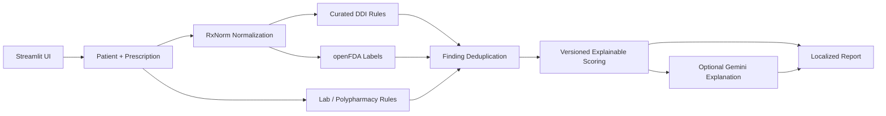

<div align="center">

# PolyPharm AI

### Explainable polypharmacy risk analysis and prescription safety support

A bilingual, deterministic-first clinical decision-support **engineering prototype**
for exploring medication interactions, laboratory risk signals, evidence provenance,
explainable scoring, and optional LLM-assisted explanations.

[Architecture](docs/architecture.md) ·
[Methodology](docs/methodology.md) ·
[Evaluation](docs/evaluation.md) ·
[Limitations](docs/limitations.md) ·
[Release Guide](docs/release.md)

</div>

> [!WARNING]
> **PolyPharm AI is a research and educational prototype.**
> It is not a medical device and must not be used for diagnosis, prescribing,
> treatment decisions, or real patient care. Do not enter identifiable patient data.

## Project Snapshot

| Capability | Status |
|---|---|
| Deterministic drug-interaction rules | Implemented |
| Renal / hepatic / polypharmacy rules | Implemented |
| RxNorm normalization | Implemented |
| openFDA label enrichment | Optional |
| Explainable safety score | Implemented |
| Rule/evidence provenance | Implemented |
| English / Turkish output | Implemented |
| Optional Gemini explanation | Implemented |
| Synthetic evaluation suite | **42/42 cases passed** |
| Expected-rule recall | **39/39 (100%)** |
| Docker runtime | Verified |
| GitHub Actions quality pipeline | Included |

The evaluation metrics above are **software regression/behavioral metrics against
synthetic expectations**, not clinical validation metrics.

## Why This Project Exists

Polypharmacy risk assessment involves more than checking whether two medication
names appear in an interaction table. A useful engineering prototype also needs
to answer:

- Was the medication normalized from a brand name to an ingredient?
- Did the signal come from a curated rule, a prototype laboratory rule, or an
  official label?
- Which finding changed the safety score?
- Which rule version produced that finding?
- Can the system continue working if an external API or LLM is unavailable?
- Can the deterministic behavior be regression-tested reproducibly?

PolyPharm AI was built around those questions.

## Key Features

- Local RxNorm-backed medication normalization and brand-to-ingredient resolution
- Curated deterministic drug-drug interaction rules
- Rule-based renal, hepatic, age, and polypharmacy risk signals
- Optional openFDA label retrieval and interaction-section scanning
- Versioned scoring policy
- Per-finding score attribution
- Finding categories, evidence types, rule IDs, rule versions, and evidence references
- Conservative duplicate-finding suppression
- Bilingual English / Turkish UI, findings, reports, and optional AI explanations
- Markdown report export and structured JSON output
- Offline deterministic fallback when external services are unavailable
- Synthetic evaluation framework with strict regression gating
- Ruff, mypy, pytest, coverage reporting, pre-commit, Docker, and GitHub Actions

## Architecture



The deterministic pipeline owns the risk findings and safety score. Gemini is
an optional explanation layer and does **not** calculate or modify the score.

See [docs/architecture.md](docs/architecture.md) for the full design.

## Analysis Pipeline

1. Validate patient and prescription input with Pydantic.
2. Normalize medication names with RxNorm when available.
3. Evaluate curated local interaction rules.
4. Evaluate renal, hepatic, and polypharmacy prototype rules.
5. Optionally inspect openFDA drug labels.
6. Attach category, source, evidence type, rule identity, and version metadata.
7. Conservatively suppress exact logical duplicates.
8. Calculate the deterministic safety score using a versioned scoring policy.
9. Produce a full score breakdown with per-finding deductions.
10. Generate a localized Markdown report.
11. Optionally ask Gemini to explain the already-computed structured result.

## Explainable Scoring

The current prototype policy starts at `100` and applies deterministic penalties:

| Severity | Base penalty |
|---|---:|
| Critical | -50 |
| High | -35 |
| Medium | -20 |
| Low | -10 |

Each score contribution preserves:

```text
finding_index
severity
category
base_penalty
applied_penalty
source
agent
evidence_type
rule_id
rule_version
evidence_reference
```

Category-cap support exists in the scoring engine but is intentionally disabled
by default. The project does not invent clinical-looking calibration parameters
without an evaluation basis.

See [docs/methodology.md](docs/methodology.md).

## Evidence & Provenance

Examples:

```text
Curated interaction rule
  rule_id: DDI-aspirin-warfarin
  rule_version: 1.0.0
  evidence_reference: polypharm-curated-ddi@1.0.0
```

```text
Prototype renal rule
  rule_id: LAB-RENAL-MODERATE
  rule_version: 1.0.0
  evidence_type: prototype_rule
```

```text
openFDA label finding
  evidence_type: official_label
  evidence_reference: openFDA:drug_interactions
```

Official openFDA excerpts remain in their source language rather than being
silently translated and presented as if the translation were official label text.

## Synthetic Evaluation

The deterministic evaluation suite contains **42 synthetic cases** covering all
curated DDI rules, negative controls, laboratory rules, polypharmacy rules, and
a combined multi-signal case.

Latest reviewed local baseline:

```text
Dataset: polypharm-synthetic-evaluation@1.0.0
Scoring policy: 1.1.0
Cases: 42/42 passed (100.0%)
Expected-rule recall: 100.0% (39/39)
Risk-level agreement: 100.0%
Score-range agreement: 100.0%
Unexpected findings: 0
Duplicates suppressed: 0
```

This means the implementation matches the project's configured synthetic
expectations. It does **not** demonstrate clinical accuracy.

Run it with:

```bash
python scripts/run_evaluation.py --strict
```

See [docs/evaluation.md](docs/evaluation.md).

## Repository Structure

```text
PolyPharm-AI/
├── app/
│   ├── components/
│   ├── locales/
│   ├── styles/
│   ├── i18n.py
│   ├── runtime.py
│   └── main.py
├── agents/
├── core/
├── providers/
├── models/
├── evaluation/
├── data/
├── scripts/
├── tests/
├── docs/
├── Dockerfile
├── compose.yaml
├── pyproject.toml
├── requirements.txt
└── requirements-dev.txt
```

## Technology Stack

**Application:** Python 3.11, Streamlit, Pydantic, Pandas  
**Medication data:** RxNorm, SQLite, openFDA  
**AI explanation:** Google Gemini (optional)  
**Quality:** Pytest, pytest-cov, Ruff, mypy, pre-commit  
**Delivery:** Docker, Docker Compose, GitHub Actions

## Quick Start

```bash
git clone https://github.com/KurKigal/PolyPharm-AI.git
cd PolyPharm-AI
python -m venv .venv
```

Windows PowerShell:

```powershell
.venv\Scripts\activate
python -m pip install -r requirements.txt
streamlit run app/main.py
```

macOS / Linux:

```bash
source .venv/bin/activate
python -m pip install -r requirements.txt
streamlit run app/main.py
```

Open `http://localhost:8501`.

### Docker

```bash
docker build -t polypharm-ai .
docker run --rm -p 8501:8501 polypharm-ai
```

Or:

```bash
docker compose up --build
```

## Optional External Services

Create `.env` from `.env.example`:

```env
GEMINI_API_KEY=
OPENFDA_API_KEY=
```

Both are optional. Without them, the application retains its local deterministic path.

## Development

```bash
python -m pip install -r requirements-dev.txt
python scripts/verify.py
```

The verification pipeline checks Ruff, targeted mypy, pytest with coverage, and
the deterministic synthetic evaluation.

Optional:

```bash
pre-commit install
pre-commit run --all-files
```

## CI / Deployment Readiness

GitHub Actions contains separate gates for code quality, static type checking,
automated tests, coverage generation, deterministic evaluation, Docker image
build, and a Streamlit container health check.

## Safety Model

PolyPharm AI deliberately separates deterministic analysis from generative AI.
The LLM does not create the score, change severity, or determine deterministic
rule matches.

## Limitations

The local dataset is limited, laboratory logic is simplified, the safety score
is not clinically calibrated, openFDA is not a complete structured interaction
database, the evaluation is synthetic, and Gemini output may be inaccurate.

Read [docs/limitations.md](docs/limitations.md).

## Roadmap After v1.0

- drug-class and ontology-aware interaction matching
- larger externally reviewed interaction datasets
- expert-reviewed synthetic cases
- clinically meaningful scoring research
- confidence/evidence-quality modelling
- richer RxNorm concept handling
- observability and telemetry
- hosted demo deployment
- domain-expert UI/UX review

## Release Status

**Target release:** `v1.0.0` — portfolio / engineering prototype.

This is not a clinical product release.

## Author

**Emirhan Keser**

Computer Engineer focused on machine learning, data science, and software
product development.

- GitHub: [KurKigal](https://github.com/KurKigal)
- LinkedIn: [Emirhan Keser](https://www.linkedin.com/in/emirhan-keser/)

