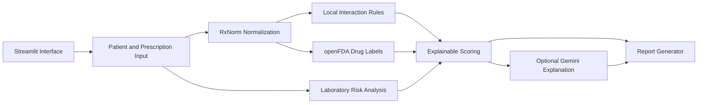

<div align="center">

# PolyPharm AI

### Explainable polypharmacy risk analysis and prescription safety support

PolyPharm AI is an educational clinical decision-support prototype that
combines deterministic risk rules, RxNorm drug normalization, openFDA drug
labels and optional LLM-generated explanations.

 [Architecture](docs/architecture.md) ·
[Methodology](docs/methodology.md) · [Limitations](docs/limitations.md)

</div>

> [!WARNING]
> PolyPharm AI is a research and educational prototype.
> It is not a medical device and must not be used for diagnosis,
> prescribing, treatment decisions or real patient care.

## Overview

Polypharmacy is the concurrent use of multiple medications and is especially
common among older adults and patients with chronic conditions.

Evaluating a new prescription may require clinicians to consider:

- potential drug-drug interactions,
- kidney function,
- liver function,
- patient age,
- medication count,
- boxed warnings,
- and incomplete or conflicting drug information.

PolyPharm AI demonstrates how these signals can be collected and presented in
an explainable, modular and failure-tolerant software architecture.

The system does not replace clinical judgement. Its purpose is to explore
software engineering and AI patterns for clinical decision-support systems.

## Key Features

- Medication name normalization using a local RxNorm SQLite database
- Brand-to-ingredient resolution
- Rule-based drug-drug interaction analysis
- Kidney and liver risk screening
- Age and polypharmacy risk analysis
- openFDA drug-label and boxed-warning retrieval
- FDA label interaction scanning
- Explainable safety score
- Risk findings with severity, source and recommendation
- Optional Turkish clinical explanation generated with Google Gemini
- Offline fallback when external services are unavailable
- Markdown report export
- JSON analysis output
- Automated unit, integration and smoke tests
- GitHub Actions continuous integration

## How It Works



## Analysis Pipeline

1. The medication names are normalized through RxNorm.
2. Local deterministic interaction rules are evaluated.
3. Laboratory values are checked for kidney and liver risk indicators.
4. openFDA labels are queried when the service is enabled.
5. Findings are sorted by severity.
6. A deterministic safety score and risk level are calculated.
7. A structured report is generated.
8. Gemini may optionally convert the structured findings into a
   user-friendly Turkish explanation.

The LLM does not calculate the safety score and is not the source of the
clinical risk decisions.

## Architecture

```text
PolyPharm-AI/
├── app/
│   └── main.py
├── agents/
│   ├── fda_interaction_agent.py
│   ├── gemini_explainer.py
│   ├── interaction_agent.py
│   ├── lab_risk_agent.py
│   ├── orchestrator.py
│   ├── report_agent.py
│   └── scoring_agent.py
├── providers/
│   ├── drug_data_service.py
│   ├── local_json_provider.py
│   ├── openfda_client.py
│   └── rxnorm_provider.py
├── models/
│   └── schemas.py
├── data/
├── scripts/
├── tests/
└── docs/
```

### Core Components

| Component                  | Responsibility                                        |
| -------------------------- | ----------------------------------------------------- |
| `Orchestrator`             | Coordinates the complete analysis workflow            |
| `InteractionAgent`         | Evaluates local deterministic interaction rules       |
| `FdaLabelInteractionAgent` | Searches drug-label interaction sections              |
| `LabRiskAgent`             | Evaluates kidney, liver and polypharmacy risks        |
| `ScoringAgent`             | Produces the deterministic safety score               |
| `ReportAgent`              | Generates summaries and Markdown reports              |
| `GeminiExplainer`          | Produces an optional natural-language explanation     |
| `DrugDataService`          | Provides a facade over RxNorm, openFDA and local data |

## Technology Stack

* Python
* Streamlit
* Pydantic
* Pandas
* SQLite
* RxNorm
* openFDA
* Google Gemini
* Pytest
* GitHub Actions

## Installation

### 1. Clone the repository

```bash
git clone https://github.com/KurKigal/PolyPharm-AI.git
cd PolyPharm-AI
```

### 2. Create a virtual environment

```bash
python -m venv .venv
```

Windows:

```powershell
.venv\Scripts\activate
```

macOS/Linux:

```bash
source .venv/bin/activate
```

### 3. Install dependencies

```bash
pip install -r requirements.txt
```

### 4. Configure optional external services

```bash
cp .env.example .env
```

Windows PowerShell:

```powershell
Copy-Item .env.example .env
```

```env
GEMINI_API_KEY=
OPENFDA_API_KEY=
```

Both variables are optional. Without API keys, the application continues to
operate using its local rule-based analysis mode.

### 5. Run the application

```bash
streamlit run app/main.py
```

## Running Tests

```bash
python -m pytest -q
```

The test suite covers:

* interaction analysis,
* laboratory risk analysis,
* scoring,
* reporting,
* RxNorm normalization,
* openFDA client behavior,
* AI explanation fallback,
* orchestration,
* and Streamlit smoke tests.

## Data Sources

### RxNorm

RxNorm is used for medication-name normalization and brand-to-ingredient
resolution. The project uses a locally generated SQLite database to reduce
runtime dependency on external services.

### openFDA

openFDA drug-label data is used to retrieve:

* boxed warnings,
* interaction sections,
* warnings and precautions,
* and selected official label context.

Availability of a drug label does not guarantee that every possible clinical
interaction is represented.

### Local Interaction Rules

A small curated local dataset is used to demonstrate deterministic interaction
analysis. It is not a complete clinical interaction database.

## Safety and Explainability

PolyPharm AI separates deterministic analysis from generative AI:

* interaction and laboratory findings are generated by explicit rules,
* the safety score is deterministic,
* the data source is attached to each finding,
* the LLM is used only for optional explanation,
* the application remains operational when the LLM is unavailable.

This design reduces the risk of allowing generated text to silently alter the
underlying risk assessment.

## Current Limitations

* The local interaction dataset has limited coverage.
* Laboratory rules are simplified and are not patient-specific dosing rules.
* openFDA label text is not a complete structured interaction database.
* The safety score has not been clinically validated.
* The application has not been evaluated as a medical device.
* Generated explanations may contain inaccuracies.
* Real patient data must not be entered into the public demo.
* Results must not be used for clinical decision-making.

## Roadmap

* [ ] Refactor the Streamlit interface into reusable components
* [ ] Add transparent score attribution
* [ ] Version and document all clinical rules
* [ ] Build a synthetic evaluation dataset
* [ ] Add drug-class-based interaction detection
* [ ] Add structured confidence and provenance metadata
* [ ] Add Docker deployment
* [ ] Publish a hosted demonstration
* [ ] Add performance and evaluation metrics
* [ ] Conduct domain-expert interface review

## Project Status

PolyPharm AI is under active individual development.

The current version should be considered an engineering and research prototype,
not a clinically validated product.

## Author

**Emirhan Keser**

Computer Engineer focused on machine learning, data science and software
product development.

* GitHub: [KurKigal](https://github.com/KurKigal)
* LinkedIn: [Emirhan Keser](https://www.linkedin.com/in/emirhan-keser/)

## License

A license will be added before the first public release.
