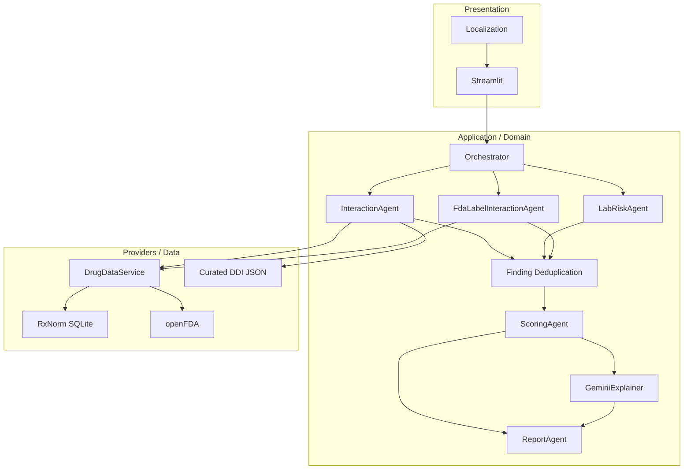
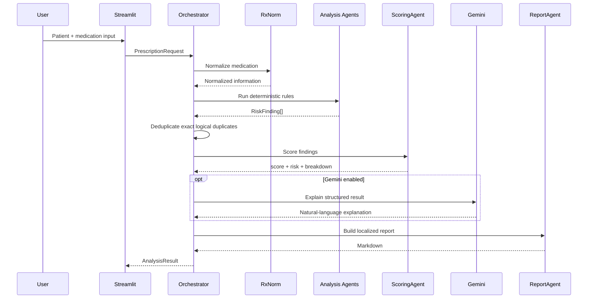

# Architecture

## Design Goals

PolyPharm AI is structured around five engineering goals:

1. deterministic risk ownership,
2. explainability,
3. provenance,
4. failure tolerance,
5. separation of concerns.

## High-Level Architecture

## Layer Responsibilities

### `app/`
Presentation, Streamlit components, localization, score-breakdown rendering,
report download.

### `agents/`
`InteractionAgent` matches curated DDI rules. `LabRiskAgent` creates simplified
renal/hepatic/polypharmacy findings. `FdaLabelInteractionAgent` scans official
label text. `ScoringAgent` owns deterministic scoring. `ReportAgent` generates
localized reports. `GeminiExplainer` is optional explanation only.
`Orchestrator` coordinates the complete workflow.

### `core/`
Finding deduplication, localization helpers, and versioned scoring policy.

### `providers/`
RxNorm, openFDA, local JSON rules, and the drug-data facade.

### `models/`
Pydantic contracts: `Patient`, `PrescriptionRequest`, `RiskFinding`,
`ScoreContribution`, `ScoreBreakdown`, and `AnalysisResult`.

### `evaluation/`
Offline deterministic behavioral/regression evaluation.

## Request Flow

## Trust Boundary

The main trust boundary separates deterministic risk logic from generative
explanation. Gemini receives structured findings after deterministic analysis;
it does not own risk decisions or scoring.

## Failure Modes

- **RxNorm unavailable:** analysis can continue with entered names; normalization quality decreases.
- **openFDA unavailable:** local rules, lab rules, scoring, and reporting continue.
- **Gemini unavailable:** deterministic output remains complete.
- **Rule absent:** no local DDI finding is produced; absence does not imply safety.

## Scoring Architecture

`ScoringPolicy` separates scoring configuration from scoring execution.
`ScoreBreakdown` records policy version, category penalties, contribution order,
base/applied penalties, provenance, and duplicate-suppression count.

## Deployment

The app can run directly, through Docker, or with Docker Compose. The container
uses a non-root user and Streamlit's `/_stcore/health` endpoint.
